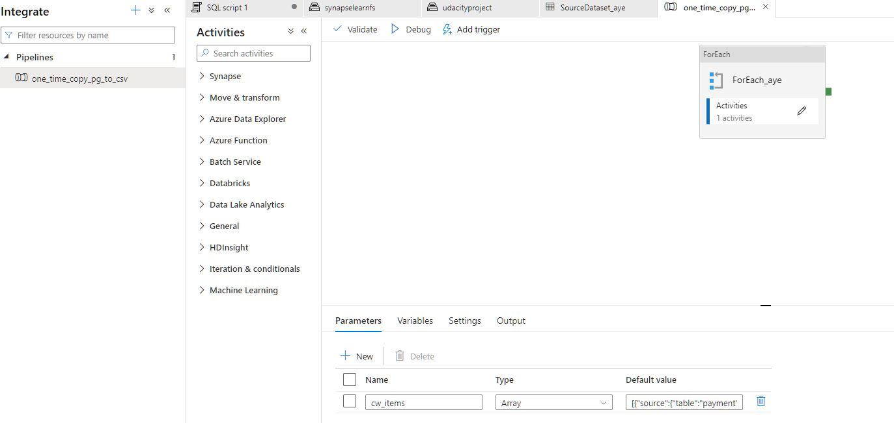
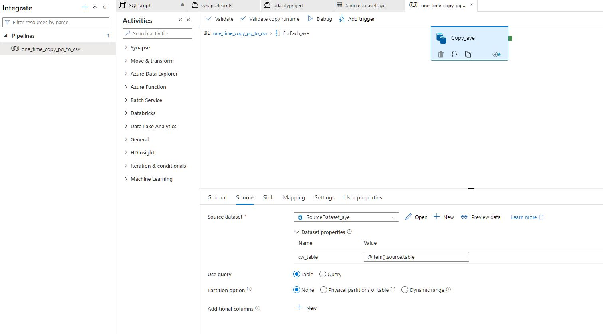
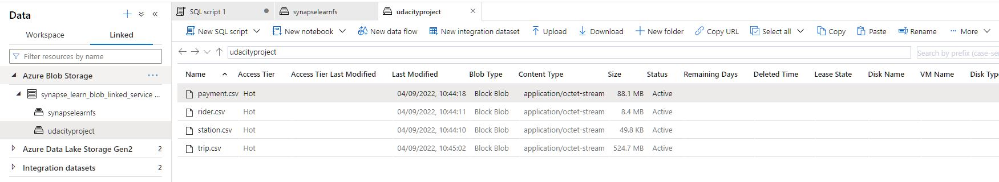

# Udacity - Azure Data Engineering - Azure Data Warehouse

The goal of this project is to develop a data warehouse solution using Azure Synapse Analytics. You will:

- Design a star schema based on the business outcomes listed below;
- Import the data into Synapse;
- Transform the data into the star schema;
- and finally, view the reports from Analytics.


## Getting Started

Instructions for how to get a copy of the project running.

## Terraform

I used Terraform to create all resources for this project.

### Configuring

First install terraform following: https://learn.hashicorp.com/tutorials/terraform/install-cli

Then, follow this tutorial to use terraform with Azure: https://registry.terraform.io/providers/hashicorp/azurerm/latest/docs/guides/azure_cli 

### Running 

``` bash
terraform init
terraform apply
```
Wait some minutes and all the resources should be good to go.

After run the initial script to insert information on the postgres database
```
python starter/ProjectDataToPostgres.py
``` 

## Scripts

All the scripts are on the folder ./scripts on the order to run.

## ER Diagram


## Pipelines 

The followings screenshots will demonstrate is able to extract data from PostgreSQL into Azure Blob Storage.





## Bussines Outcomes

The business outcomes you are designing for are as follows

1. Analyze how much time is spent per ride
    - Based on date and time factors such as day of week and time of day
    - Based on which station is the starting and / or ending station
    - Based on age of the rider at time of the ride
    - Based on whether the rider is a member or a casual rider
2. Analyze how much money is spent
    - Per month, quarter, year
    - Per member, based on the age of the rider at account start
3. EXTRA CREDIT - Analyze how much money is spent per member
    - Based on how many rides the rider averages per month
    - Based on how many minutes the rider spends on a bike per month

## License

[License](LICENSE.txt)
